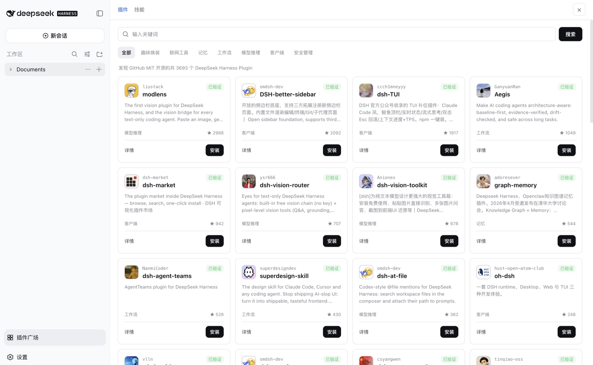
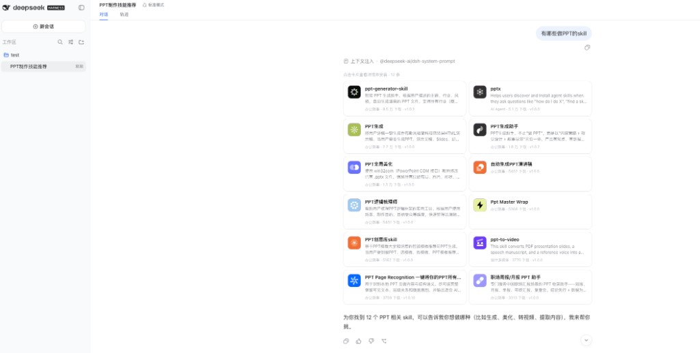
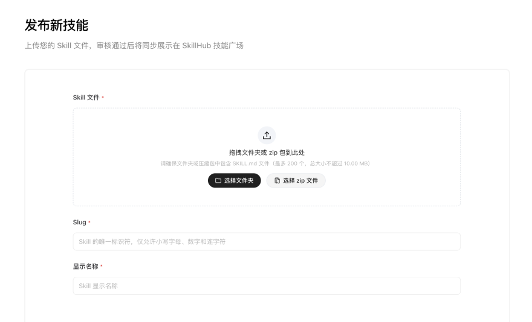
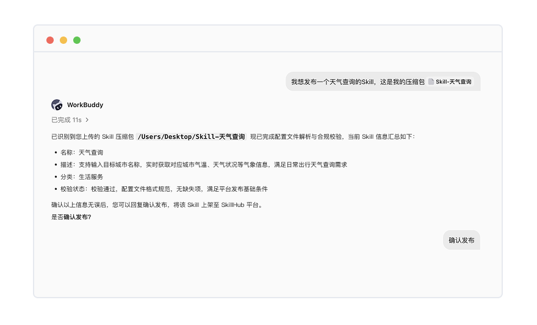

# SkillHub

[中文](README.md) | [English](README_EN.md)

专为中国用户优化的 AI Skills 社区。本仓库开源三部分：

- **Open API 文档与调用示例**（[`docs/`](docs/)）
- **DeepSeek Harness 插件**（[`dsh-plugin/`](dsh-plugin/)）
- **SkillHub 官方 Skills**（[`skills/`](skills/)）

产品站点：[skillhub.cn](https://skillhub.cn)

## 什么是 SkillHub

SkillHub 聚合全球同步与本土上传的 Skills，并提供安全认证、质量评测、企业发布和组织技能库，让 Agent 能稳定获得可信能力。

以全球优质 Skills 同步、本土创作者共建和国内下载体验优化为基础，持续沉淀面向中国用户的 AI 能力供给网络。目前已收录 **13 万+ Skills**，其中 **2 万+** 为企业发布的 Skills，并有 **500+** 商家完成上架。

| 能力 | 说明 |
|------|------|
| 全球同步与本土共建 | 持续同步全球优质 Skills（如 ClawHub），并补齐中文描述、安装路径和本土使用语境；创作者、团队和企业也可以自行发布，平台不只是同步镜像 |
| 国内高速下载 | 为国内网络优化下载链路，减少装不上、下载慢和依赖不稳定 |
| 双重安全认证 | 平台内 Skills 经过双重安全认证，围绕 Prompt 投毒、恶意代码、数据泄露和供应链风险生成可查看报告 |
| TRACE 质量评测 | 用 TRACE 标准形成可参考的评测报告；结合推荐榜、下载热榜、最近上新和标签筛选，选择不只靠下载量 |
| 企业发布与内部技能库 | 组织账号可对外发布（蓝 V 认证），也可把内部 Prompt、流程和工具调用沉淀为仅团队可见的技能库 |
| Soul.md 与技能包 | 用 Soul.md 定义 Agent 的表达、角色和协作方式，再叠加精选行业技能包，组合出专属 Agent |

开发者可以在这里分享 Skill，Agent 和各类应用也可以直接查找和使用这些能力。更完整的产品说明见 [skillhub.cn/about](https://skillhub.cn/about)。精选能力见 [skillhub.cn/#featured](https://skillhub.cn/#featured)。

### 产品截图









## 仓库结构

| 目录 | 内容 |
|------|------|
| [`docs/`](docs/) | Open API 文档、接入说明与可运行示例 |
| [`dsh-plugin/`](dsh-plugin/) | DeepSeek Harness 的 SkillHub 插件（npm：`@tencent/skillhub`） |
| [`skills/`](skills/) | SkillHub 官方维护的 Skill |

## Open API

[SkillHub CLI](https://skillhub.cn) 已经支持在终端完成 Skill 的发现、安装、发布与校验。开放 HTTP + JSON 接口，是为了覆盖 CLI 覆盖不到的产品接入场景：在 Agent、IDE、浏览器插件或企业门户中内嵌搜索与安装，搭建自己的技能广场，或在服务端批量同步与治理 Skill。

| 你想做什么 | 可以使用的能力 |
|------------|----------------|
| 在产品中加入 Skill 搜索 | 搜索、分类、榜单、推荐和详情 |
| 展示并安装 Skill | 文件、版本、版本差异和下载 |
| 判断 Skill 是否可靠 | 评测、测试结果、签名和验签 |
| 发布与治理 | 发布、导入、版本、组织内私有 Skill |
| 在 Agent 中运行 | 沙箱、会话、流式输出和文件处理 |

快速开始：

```bash
export SKILLHUB_BASE_URL='https://api.skillhub.cn'

curl "$SKILLHUB_BASE_URL/api/skills?sortBy=downloads&order=desc&pageSize=5"
curl "$SKILLHUB_BASE_URL/api/v1/skills/find-skill-skillhub"
```

完整说明、接口总览与字段约定见 [docs/README.md](docs/README.md) 和 [docs/api/README.md](docs/api/README.md)。可运行示例（Shell / Node.js / Python）见 [docs/examples/](docs/examples/)：

```bash
bash docs/examples/curl/quickstart.sh
node docs/examples/node/list-skills.mjs
python3 docs/examples/python/list_skills.py
```

公开 API 可直接按文档接入。访问组织内 Skill 需要相应成员权限。较大调用量、沙箱或模型等高消耗能力，建议上线前按 [docs/apply.md](docs/apply.md) 联系我们。

## DeepSeek Harness 插件

[`dsh-plugin/`](dsh-plugin/) 让你在 DeepSeek Harness 对话里搜索 SkillHub 技能、查看详情，并安装到本机 skills 目录。也支持按分类浏览、版本选择、卸载、侧栏「插件广场」，以及对话内搜索 / 直装 DSH 插件。

从 GitHub 安装：

```sh
dsh plugin --profile web add github:Tencent/skillhub#path:dsh-plugin
```

也可以从 npm 安装（预构建）：`dsh plugin --profile web add @tencent/skillhub`。

本地开发：

```sh
dsh plugin --profile web add /absolute/path/to/skillhub/dsh-plugin
```

安装后重启 `dsh web`（请绑定 `127.0.0.1`），并强制刷新浏览器。请使用带 scope 的 `@tencent/skillhub`，不要安装 npm 上的无前缀包 `skillhub`。

功能、配置、开发与故障排查见 [dsh-plugin/README.md](dsh-plugin/README.md)。

## 官方 Skills

[`skills/`](skills/) 是 SkillHub 官方维护的 Skill，可直接给 Agent 使用，也和平台上的同名 Skill 对应。

| Skill | 说明 |
|-------|------|
| [find-skill-skillhub](skills/find-skill-skillhub/) | 在 SkillHub 上按关键词、分类查找和推荐 Skill |
| [skillhub-trace-evaluator](skills/skillhub-trace-evaluator/) | 按 TRACE 五维（Trust / Reliability / Adaptability / Convention / Effectiveness）评测 Skill 包质量 |

把对应目录拷到 Agent 可发现的 skills 路径即可使用，也可以在 [skillhub.cn](https://skillhub.cn) 搜索同名 Skill 安装。

## 贡献与问题反馈

```bash
git clone https://github.com/Tencent/skillhub.git
```

- 贡献入口见 [CONTRIBUTING.md](CONTRIBUTING.md)：API 文档走 [docs/CONTRIBUTING.md](docs/CONTRIBUTING.md)，插件走 [dsh-plugin/CONTRIBUTING.md](dsh-plugin/CONTRIBUTING.md)，官方 Skill 改 [`skills/`](skills/)
- 使用问题、文档错误、接口或插件行为异常：提交 [GitHub Issue](https://github.com/Tencent/skillhub/issues)
- 安全问题：请勿公开提交 Issue，按 [SECURITY.md](SECURITY.md) 报告

## License

本仓库以 [MIT License](LICENSE) 发布。

联系邮箱：[skillhub@tencent.com](mailto:skillhub@tencent.com)
